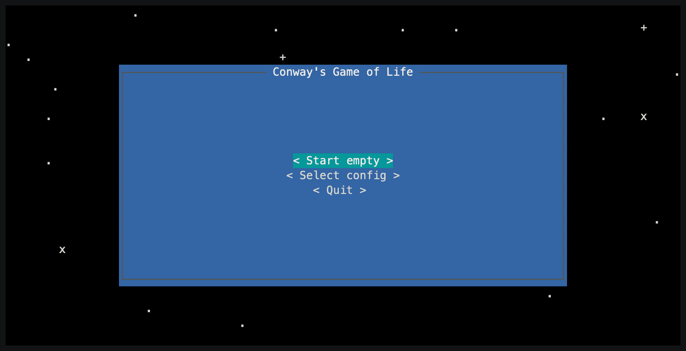

# Conway's Game of Life
Terminal based. Implemented in Python with help of [Asciimatics](https://asciimatics.readthedocs.io/en/stable/).

<p align="center">
  
</p>

## Features
- Run in terminal from anywhere.
- Insert and edit pattern presets from common **Life 1.06** file format.
- Create and save your own presets.
- See your pattern in action with realtime simulation.

## How to run
Just install all required python dependencies with
```
pip install -r requirements.txt
```
and hit
```
python main.py
```

You can also make executable using [Pyinstaller](https://pyinstaller.org/en/stable/)
